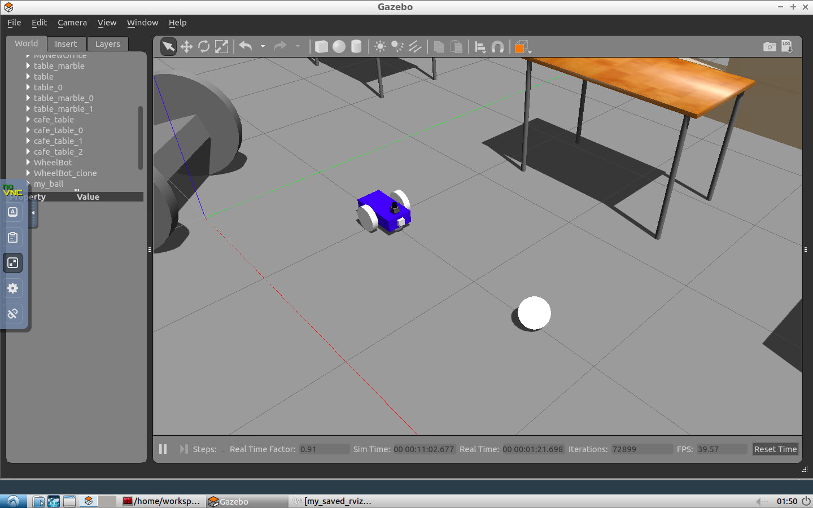
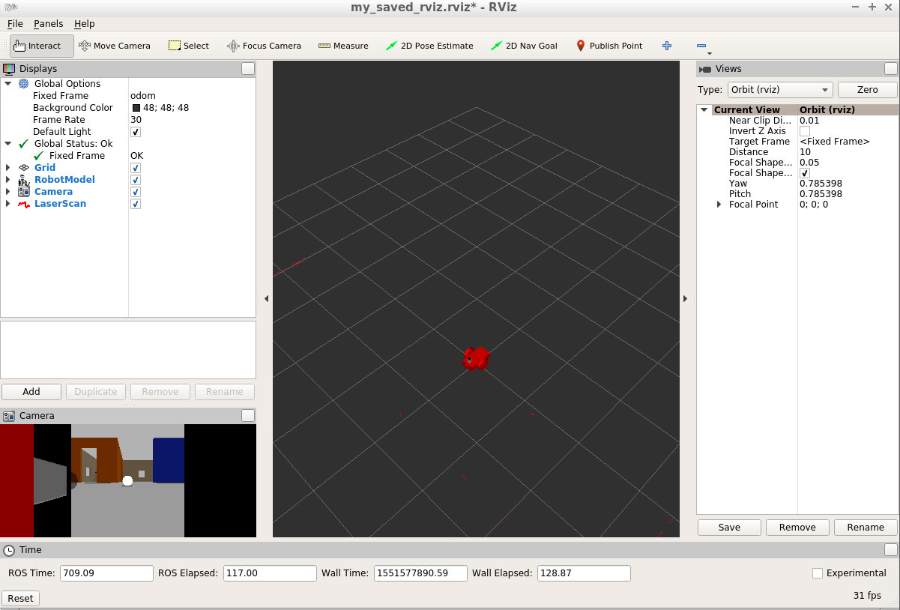

<<<<<<< HEAD
# RSE_Where_Am_I
=======
# Go Chase It - ROS Project

# Purpose

Go Chase It! This project is included in Udacity's Robotics Nanodegree Program. The goal of this project was to build and program a robot using Gazebo and ROS, to follow a white ball inside a gazebo world environment. Robot's motion could further be observed using Rviz. In this project I started by designing a robot in gazebo, and then placing the robot in another gazebo world I had previously made. I then utilized ROS to control the robots motion by programming differnt nodes in C++ within each catkin package. After completion, the robot was successfully able to follow a white ball around at different locations, while being observed in the gazebo world and in Rviz. 

# Screenshot - Go Chase It!

# Screenshot - Rviz

>>>>>>> 6487f708108f79a4934be318d2c5da040787e95e
